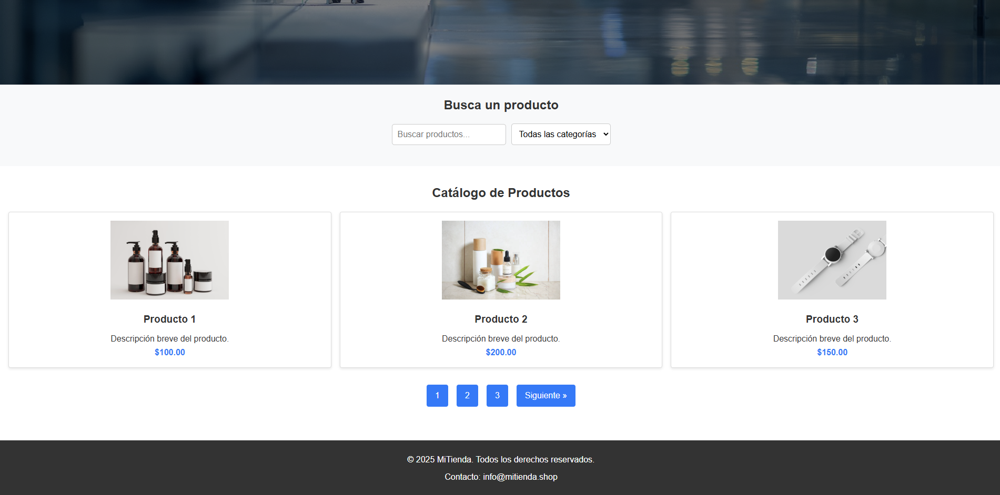

# Template de Catálogo de Productos

Este es un template básico de catálogo de productos desarrollado con **HTML, CSS y JavaScript**. Sirve como base para proyectos que requieran una galería de productos con una estructura simple y fácilmente personalizable.

---

## 🎨 Vista Previa



---

## Características
- Diseño responsive y adaptable a diferentes dispositivos.
- Código limpio y estructurado para facilitar modificaciones.
- Uso de JavaScript para la interactividad básica.
- Estilos en CSS para mejorar la apariencia visual.

---

## Estructura del Proyecto
```
/catalogo-template/
│── index.html        # Página principal con la estructura del catálogo
│── css/
│   ├── style.css     # Estilos del catálogo
│── js/
│   ├── main.js       # Funcionalidad básica con JavaScript
│── image/
│   ├── product1.jpg  # Imágenes de productos
│   ├── product2.jpg
│   ├── product3.jpeg
│   ├── slider-ropa.png
│── README.md         # Documentación del proyecto
```

---

## Instalación y Uso
1. Clona el repositorio o descarga los archivos.
   ```bash
   git clone https://github.com/tu-usuario/catalogo-template.git
   ```
2. Abre el archivo `index.html` en un navegador web.
3. Personaliza el contenido y los estilos según tus necesidades.

---

## Personalización
Puedes modificar los productos directamente en el archivo `index.html` o utilizar JavaScript para cargarlos dinámicamente desde un archivo JSON o una API.

---
